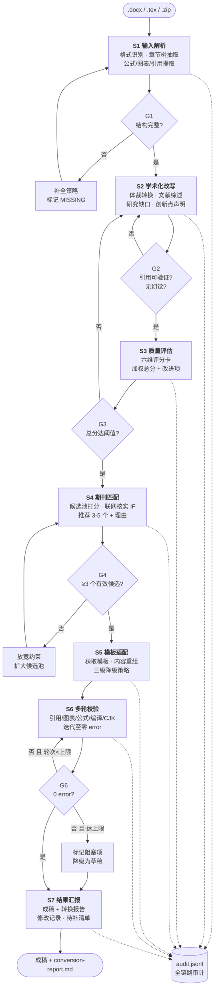

<div align="center">

# math-modeling-to-sci-skill

**把数学建模报告变成可投稿的 SCI 论文**

一个 Agent Skill：输入 Word / LaTeX 建模文章，输出学术化成稿 + 质量评分 + 期刊推荐 + 模板适配 + 转换报告。

[](https://github.com/siyunhao2025-beep/math-modeling-to-sci-skill/actions/workflows/ci.yml)
[](https://github.com/siyunhao2025-beep/math-modeling-to-sci-skill/actions/workflows/validate-skill.yml)
[](LICENSE)
[](https://www.python.org/)

[快速开始](#快速开始) · [工作流](#工作流七个阶段) · [输入输出规范](#输入输出规范) · [质量保障](#准确性与完整性保障) · [贡献](CONTRIBUTING.md)

</div>

---

## 这个项目解决什么问题

数学建模报告（竞赛论文、课程项目、企业技术报告）和 SCI 论文是**两种不同的体裁**：

| 维度 | 建模报告 | SCI 论文 |
|------|---------|---------|
| 目标读者 | 评委 | 同领域研究者 |
| 组织逻辑 | 问题一/二/三 | 研究缺口 → 方法 → 验证 → 贡献 |
| 文献 | 可选、少量 | 必需、构成研究定位 |
| 创新表述 | 隐含在解法里 | 必须显式声明并与前人对比 |
| 语言 | 陈述解题过程 | 论证学术主张 |
| 篇幅结构 | 假设/符号说明占大头 | Intro + Related Work 占大头 |

手工转换要反复处理体裁改写、文献补齐、期刊选择、模板排版、格式校验——本项目把这条链路
拆成 7 个可审计、可断点续跑的阶段，每阶段有独立提示词、结构化输入输出契约和质量门控。

**它不做什么**：不替你做研究，不编造实验数据，不保证录用。原文缺什么，它会明确告诉你缺什么。

## 特性

- **双格式输入** — `.docx`、`.tex` 单文件、LaTeX 多文件工程（`.zip`），自动识别
- **结构化中间表示（IR）** — 所有阶段围绕 `manuscript.ir.json` 流转，JSON Schema 强校验
- **六维质量评分卡** — 创新性/严谨性/完整性/表达/结构/可复现性，加权总分 + 可执行改进项
- **期刊匹配带证据** — 3–5 个推荐，每个附 IF、分区、Aims&Scope 契合点、拒稿风险、检索来源
- **模板适配三级降级** — 官方模板 → 出版商通用 → 内置骨架，降级必声明
- **多轮硬校验** — 引用/图表/公式/编译/CJK 残留，迭代到零 error 才放行
- **全链路审计** — `audit.jsonl` append-only 记录每次调用、每个门控决策、每次自动修复
- **反幻觉设计** — 缺失内容标 `[[MISSING]]`，未验证引用标 `[[UNVERIFIED_REF]]`，绝不填空

## 快速开始

### 安装

```bash
git clone https://github.com/siyunhao2025-beep/math-modeling-to-sci-skill.git
cd math-modeling-to-sci-skill
pip install -r requirements.txt
```

可选但推荐（用于 LaTeX 编译校验与 PDF 产出）：

```bash
# TeX Live 或 MiKTeX，需包含 latexmk 与 biber
latexmk --version && biber --version
```

### 作为 Agent Skill 使用

把仓库放进你的 Agent 技能目录：

```bash
# WorkBuddy / Claude Code 用户级
cp -r math-modeling-to-sci-skill ~/.workbuddy/skills/math-modeling-to-sci

# 项目级
cp -r math-modeling-to-sci-skill <your-project>/.workbuddy/skills/math-modeling-to-sci
```

然后直接对话：

> 把 `报告.docx` 改成 SCI 论文，评估一下质量，推荐几个能投的期刊，套好模板给我。

Agent 会读取 `SKILL.md` → `prompts/00-orchestrator.md`，按七阶段自动执行。

### 作为命令行工具使用

```bash
# 全自动
python scripts/run_pipeline.py --input path/to/report.docx --workdir runs/my-paper --mode auto

# 交互式（每个质量门控暂停确认，首次推荐）
python scripts/run_pipeline.py --input path/to/report.tex --workdir runs/my-paper --mode interactive

# 只评估不改写
python scripts/run_pipeline.py --input path/to/report.tex --workdir runs/eval --mode dry-run

# 断点续跑：从 S5 开始
python scripts/run_pipeline.py --workdir runs/my-paper --stage S5

# 指定目标期刊，跳过自动匹配
python scripts/run_pipeline.py --workdir runs/my-paper --stage S5 --journal "Applied Mathematical Modelling"

# 查看审计轨迹
python scripts/run_pipeline.py --workdir runs/my-paper --show-audit
```

试跑内置示例：

```bash
python scripts/run_pipeline.py --input examples/input/sample-model-report.tex --workdir runs/demo --mode dry-run
```

## 工作流：七个阶段



各阶段职责与提示词一览：

| # | 阶段 | 提示词 | 关键产物 | 门控 |
|---|------|--------|---------|------|
| S1 | 输入解析 | [`01-ingest-parse.md`](prompts/01-ingest-parse.md) | `manuscript.ir.json` | G1 结构完整性 |
| S2 | 学术化改写 | [`02-academic-rewrite.md`](prompts/02-academic-rewrite.md) | `manuscript.rewritten.json`、`references.bib` | G2 引用可验证 |
| S3 | 质量评估 | [`03-quality-assessment.md`](prompts/03-quality-assessment.md) | `assessment.json` | G3 分数阈值 |
| S4 | 期刊匹配 | [`04-journal-matching.md`](prompts/04-journal-matching.md) | `journal-match.json` | G4 候选数量 |
| S5 | 模板适配 | [`05-template-adaptation.md`](prompts/05-template-adaptation.md) | `build/main.tex`/`main.docx` | G5 模板就绪 |
| S6 | 多轮校验 | [`06-multi-round-validation.md`](prompts/06-multi-round-validation.md) | `validation-final.json` | **G6 零 error（硬）** |
| S7 | 结果汇报 | [`07-final-report.md`](prompts/07-final-report.md) | `conversion-report.md` | — |

编排逻辑、数据流转、阶段衔接契约见 [`prompts/00-orchestrator.md`](prompts/00-orchestrator.md)
与 [`docs/architecture.md`](docs/architecture.md)。

## 输入输出规范

### 输入

| 格式 | 扩展名 | 支持度 | 说明 |
|------|--------|--------|------|
| Word | `.docx` | 完整 | 需为标准 OOXML；`.doc` 请先转存 |
| LaTeX 单文件 | `.tex` | 完整 | 自动解析 `\input`/`\include` |
| LaTeX 工程 | `.zip` | 完整 | 自动定位主文件（含 `\documentclass`） |
| Markdown | `.md` | 实验性 | 转 IR 后走同一链路 |
| PDF | `.pdf` | 不支持 | 抽取保真度不可控，请提供源文件 |

对输入的要求（不满足时会降级处理并在报告中提示）：

- 有可识别的标题与章节层级（Word 用样式或粗体，LaTeX 用 `\section`）
- 图表有编号或题注（缺失时自动编号并记录）
- 公式为可解析文本或 OMML（Word 的公式图片无法解析，会写入 `gaps`）
- 参考文献有独立章节或 `.bib` 文件

### 输出

```
runs/<name>/
├── 07-report/
│   ├── conversion-report.md      ← 先看这个
│   ├── manuscript-final.pdf
│   └── manuscript-final.docx
├── 05-template/build/
│   ├── main.tex                  ← 投稿用源文件
│   ├── references.bib
│   └── figures/
├── 03-assess/assessment.json     ← 质量评分卡
├── 04-journals/journal-match.json ← 期刊推荐
└── audit.jsonl                   ← 审计日志
```

`conversion-report.md` 的固定结构：

1. **转换摘要** — 输入格式、目标期刊、最终状态（可投稿 / 需补充 / 阻塞）
2. **质量评分卡** — 六维得分、加权总分、与阈值对比
3. **逐章修改记录** — 原文位置 → 改写后位置 → 改动类型 → 理由
4. **期刊推荐表** — 3–5 个，含 IF、分区、周期、契合理由、风险
5. **校验结果** — 各轮 error/warning 数量、已自动修复项、残留项
6. **待补清单** — 所有 `[[MISSING]]`，按优先级排序，附具体补充指引
7. **投稿前 checklist** — 逐项勾选表
8. **降级与限制声明** — 所有降级处理的如实披露

### 中间表示（IR）

所有阶段共享的数据契约，schema 见 [`config/schema/manuscript.schema.json`](config/schema/manuscript.schema.json)：

```json
{
  "schema_version": "1.0",
  "meta": { "title": "...", "authors": [...], "keywords": [...], "language": "zh" },
  "sections": [
    {
      "id": "sec-3",
      "level": 1,
      "heading": "模型建立",
      "semantic_role": "methodology",
      "blocks": [
        { "type": "paragraph", "text": "..." },
        { "type": "equation", "id": "eq-7", "latex": "...", "numbered": true },
        { "type": "figure", "id": "fig-2", "caption": "...", "path": "figures/f2.png" }
      ]
    }
  ],
  "equations": [...], "figures": [...], "tables": [...],
  "references": [...], "symbol_map": {...},
  "gaps": [ { "id": "gap-1", "severity": "high", "where": "sec-4", "what": "缺少对照实验" } ]
}
```

`semantic_role` 取值：`abstract` `introduction` `related_work` `problem_statement`
`assumptions` `notation` `methodology` `experiments` `results` `discussion`
`conclusion` `limitations` `references` `appendix` `unclassified`

## 准确性与完整性保障

四层机制，详见 [`docs/architecture.md`](docs/architecture.md)。

### 1. 质量门控（Quality Gate）

配置在 [`config/quality-gates.yaml`](config/quality-gates.yaml)，每个门控定义
判定条件、失败动作（`retry` / `rollback` / `degrade` / `block`）、最大重试次数。

| Gate | 位置 | 判定 | 失败动作 |
|------|------|------|---------|
| G1 | S1 后 | 必需章节齐全、公式/图表未丢失 | `retry`（换解析策略）→ `degrade` |
| G2 | S2 后 | 无未验证引用、无幻觉数值、术语一致 | `retry`（最多 2 次）→ `block` |
| G3 | S3 后 | 加权总分 ≥ `min_total_score` | `rollback` 到 S2 定向重写 |
| G4 | S4 后 | 有效候选 ≥ 3 | `retry`（放宽 scope 约束） |
| G5 | S5 后 | 模板文件就绪、字段映射完备 | `degrade`（三级降级） |
| **G6** | S6 后 | `error == 0` | `retry`（≤4 轮）→ `block` |

### 2. 多轮自检与交叉验证

- **纵向自检**：每阶段输出后先做 schema 校验，再做该阶段专属规则检查
- **横向交叉验证**：
  - 引用一致性 — 正文 `\cite` ∩ `.bib` 条目，双向零差集
  - 图表一致性 — 每个 `figure`/`table` 都被正文引用，且编号连续
  - 公式一致性 — 编号公式必被引用；符号在 `symbol_map` 中有定义
  - 数值一致性 — 改写后数值与原 IR 逐一比对，任何变动视为 error
  - 长度一致性 — 各节字数与目标期刊约束比对
- **独立复核视角**：S3 评估与 S6 校验使用互不相同的提示词与判据，避免同一视角自我确认

### 3. 错误恢复与回退

- 每阶段开始前对 `workdir` 打快照（`.snapshot/<stage>/`），失败可 `--rollback S<n>`
- 阶段产物写入采用「临时文件 + 原子替换」，中断不会留下半成品
- 外部依赖（联网检索、模板下载、LaTeX 编译）全部有降级路径，绝不硬失败
- 幂等设计：同一阶段重复执行结果一致，可安全重试

### 4. 可追溯审计

`audit.jsonl` 每行一条事件，append-only：

```json
{"ts":"2026-08-19T10:22:31Z","stage":"S6","event":"auto_fix","target":"main.tex:L214",
 "detail":"补全缺失的 \\label{fig:3}","actor":"check_figures_tables","round":2}
{"ts":"2026-08-19T10:22:40Z","stage":"S6","event":"gate_decision","gate":"G6",
 "result":"fail","reason":"2 unresolved errors","action":"retry","round":2}
```

事件类型：`stage_start` `stage_end` `gate_decision` `auto_fix` `degrade`
`external_call` `rollback` `human_input` `error`。

查看：`python scripts/run_pipeline.py --workdir runs/demo --show-audit`

## 配置

| 文件 | 作用 |
|------|------|
| [`config/pipeline.yaml`](config/pipeline.yaml) | 阶段编排、依赖、超时、重试 |
| [`config/quality-gates.yaml`](config/quality-gates.yaml) | 门控阈值与失败动作 |
| [`config/journals.yaml`](config/journals.yaml) | 期刊候选库（可扩充） |
| [`config/style-rules.yaml`](config/style-rules.yaml) | 学术语言规则（时态/语态/禁用词） |

调低质量门槛（比如先看看效果）：

```yaml
# config/quality-gates.yaml
G3:
  min_total_score: 5.5   # 默认 6.5
```

## 项目结构

```
.
├── SKILL.md                  # Skill 入口（Agent 首先读这个）
├── prompts/                  # 七阶段提示词 + 公共片段
│   ├── 00-orchestrator.md    # 编排器（总控）
│   ├── 01..07-*.md           # 各阶段提示词
│   ├── shared/               # 角色前言、IO 契约、异常处理、术语表
│   └── README.md             # 提示词衔接逻辑说明
├── config/                   # 配置与 JSON Schema
├── scripts/                  # 可执行工具层
│   ├── ingest/               # 格式检测与解析
│   ├── validate/             # 校验器（IR/引用/图表/公式/编译）
│   ├── journals/             # 期刊匹配与模板获取
│   ├── render/               # LaTeX / DOCX 渲染
│   ├── report/               # 报告生成
│   ├── audit/                # 审计日志
│   └── run_pipeline.py       # CLI 编排入口
├── assets/
│   ├── templates/            # 内置模板骨架（降级兜底）
│   └── checklists/           # 格式/引用/投稿清单
├── references/               # 领域知识文档（按需加载）
├── examples/                 # 输入输出示例
├── tests/                    # pytest
└── docs/architecture.md      # 架构、数据流、状态机
```

## 常见问题

**Q：会编造参考文献吗？**
不会。所有新增引用必须联网检索到真实 DOI 才写入 `.bib`，验证不通过的标
`[[UNVERIFIED_REF]]` 留在正文并列入待补清单。`scripts/validate/check_citations.py --verify-doi`
会强制拦截。

**Q：影响因子准确吗？**
`config/journals.yaml` 里的是带年份标注的快照，仅作候选池和 fallback。S4 会联网核实，
报告中会标明「数据来源 + 采集时间」。投稿前请自行到期刊官网复核。

**Q：Word 里的公式是图片，怎么办？**
无法解析。会记录到 `gaps` 并在报告中列出位置，请提供 LaTeX 源或 OMML 公式。

**Q：LaTeX 编译环境没装能用吗？**
能。`latex_compile_check.py` 检测不到 `latexmk` 会跳过编译校验并标记为 `degrade`，
其余校验正常执行，但报告会声明「未经编译验证」。

**Q：跑一半中断了？**
`--stage S<n>` 从任意阶段续跑，`--rollback S<n>` 回退到快照。产物写入是原子的，不会有半成品。

**Q：能保证中稿吗？**
不能，也不该有人这么承诺。它保证的是：体裁正确、格式合规、引用完整、缺陷透明。
学术贡献本身取决于你的研究。

## 路线图

- [ ] 期刊库扩充到 500+（欢迎 PR，见 [贡献指南](CONTRIBUTING.md#扩充期刊库)）
- [ ] Overleaf 项目直接导入/导出
- [ ] 投稿信（cover letter）与回复审稿意见生成
- [ ] 相似度自查（与已发表文献的表述重合度）
- [ ] 多语言支持（英→中反向、日文期刊）

## 贡献

欢迎提 Issue 和 PR。扩充期刊库、补充期刊模板、改进提示词都是高价值贡献。
请先读 [CONTRIBUTING.md](CONTRIBUTING.md) 与 [CODE_OF_CONDUCT.md](CODE_OF_CONDUCT.md)。

## 免责声明

本项目是**写作与格式化辅助工具**，不替代研究工作本身。使用者对论文的学术诚信、数据真实性、
署名合规性负全责。请勿用于伪造研究成果，或违反目标期刊 AI 使用政策的场景——
多数期刊要求披露 AI 辅助写作，请如实声明。

## 许可

[MIT](LICENSE) © 2026
